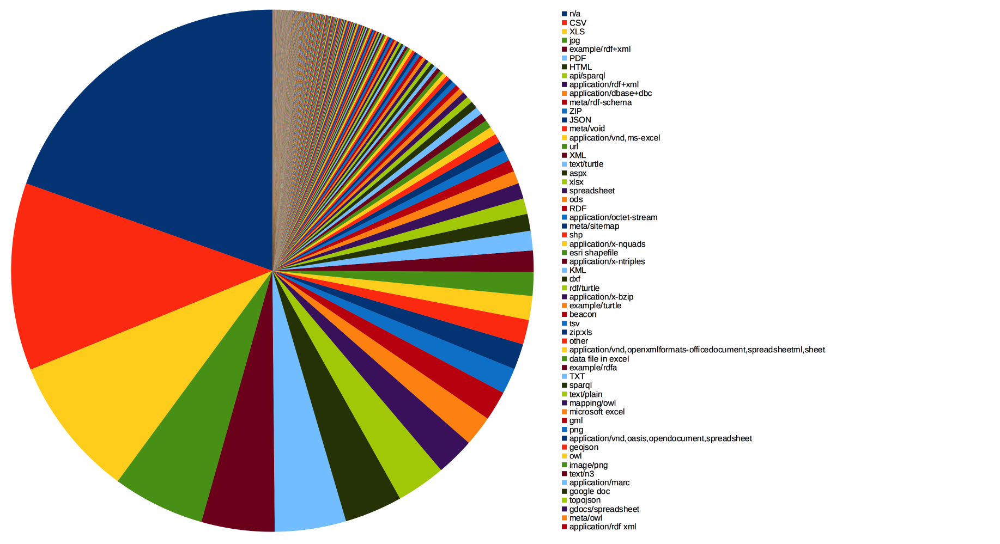
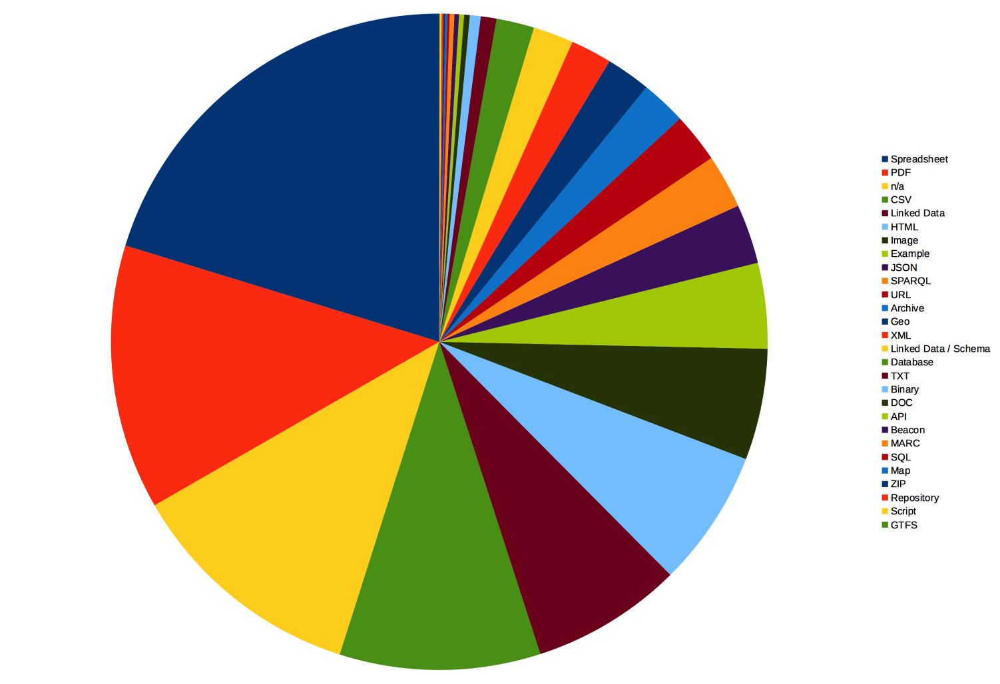

# CKAN Stats

## Setup
### 1. Retrieve meta data from CKAN-based data repositories
	CKANstats.py
### 2. Load retrieved CSV into SQL (here: PostgreSQL)
	CREATE TABLE datahubio
	(
	  dataset_id character(36),
	  dataset_name character(1024),
	  dataset_license_title character(2014),
	  dataset_license_id character(255),
	  dataset_is_open boolean,
	  dataset_tracking_summary_total integer,
	  dataset_tracking_summary_recent integer,
	  resource_id character(36),
	  resource_name character(1024),
	  resource_created character(26),
	  resource_revision_timestamp character(26),
	  resource_format character(1024),
	  resource_url character(1024),
	  resource_tracking_summary_total integer,
	  resource_tracking_summary_recent integer
	)
	
	COPY datahubio FROM 'datahubio.csv' DELIMITER ',' CSV;
	
### 3. Start querying :)
	
## First impressions

### "format" row is not unified, about 20% w/o definition
	select trim(resource_format), (COUNT(resource_format)::double precision / (select COUNT(resource_format) from datahubio)::double precision * 100) as c from datahubio
	group by resource_format order by c desc

	select trim(resource_format), COUNT(resource_format) as count from datahubio
	group by resource_format order by count desc
	

### There are at least 29 variants for the format "Excel"

	select trim(resource_format), COUNT(resource_format) as count from datahubio
	where resource_format like '%xls%' or resource_format like '%excel%' or resource_format like '%openxml%.spreadsheet%'
	group by resource_format order by count desc

resource_format|count
-----|-----
application/vnd.ms-excel|298
xlsx|196
zip:xls|54
application/vnd.openxmlformats-officedocument.spreadsheetml.sheet|50
data file in excel|49
microsoft excel|41
application/zip+application/vnd.ms-excel|10
excel|10
application/zip+vnd.ms-excel|6
format-xls|6
xls (zip)|5
application/vnd.ms-excel.sheet.binary.macroenabled.12|4
ms excel csv|2
application/x-excel|2
csv stata excel|2
xls html pdf|2
data file in stata and excel|1
html xls|1
csv xls ods pdf mm|1
data file in excel and rdf|1
data file in excel and stata|1
csv and xls|1
csv xls m.fl.|1
html xls pdf|1
csv xls prn dbase med flere|1
xls csv|1
pdf / xls|1
xls html ascii|1
csv xls openoffice pdf mm|1

### The number of resources per datasets strongly varies
	select AVG(count), STDDEV(count), variance(count) from (
		select trim(dataset_name), COUNT(resource_id) as count from datahubio
		group by dataset_name order by count desc
	) as l

avg|stddev|variance
------|------|------
3.2128405289150868|13.2269114412110874|174.9511862736407655

### Majority of the datasets have exactly one resource file associated
	select count, count(count) from (
		select trim(dataset_name), COUNT(resource_id) as 		count from datahubio
		group by dataset_name order by count desc
	) as l group by count order by l.count
		

### Some of the 'n/a' formats might be retrieved from the resource_url

	select format, count(format) from (
		select UPPER(substring(trim(resource_url) from '...$')) as format 		from datahubio where resource_format = 'n/a'	
	) as i
	group by format order by count(format) desc

format|count
----|----
PDF|747
RG/|295
CES|250
KEY|247
TML|158
PHP|53
CSV|51
ZIP|49
HTM|47
COM|34
OM/|30
SPX|30
TA/|26
D=0|23
OV/|21
JSP|19
ATA|18
ONE|16
.GZ|15
ORG|14
ES/|13
RQL|13
RCH|12
SON|12
OAD|11
AU/|11
ER/|11
=EN|10
TXT|10
DU/|9
XLS|8

### 302 of the 'n/a'-format resources are accompanied by non-'n/a'-format resources 
	select count(id) from (
		select a.id
		from 
		(select distinct(trim(dataset_id)) as id from datahubio where resource_format = 'n/a' ) as a inner join
		(select distinct(trim(dataset_id)) as id from datahubio where resource_format <> 'n/a') as b on a.id = b.id
	) as i
	
count|
-----|
302|

## Correct the mess

The mission is bascially: use a mapping table that assignes the various values stated in the resource_format-column to unified format definitions. For example, the following expressions assign the data format ``Spreadsheet``:

format|expr
----|----
Spreadsheet|%openxmlformats%spreadsheetml%
Spreadsheet|%ods%
Spreadsheet|spreadsheet
Spreadsheet|%xls%
Spreadsheet|%xls
Spreadsheet|%xlsx%
Spreadsheet|%xlxs
Spreadsheet|*ods
Spreadsheet|%excel%
Spreadsheet|%openoffice%calc%
Spreadsheet|%spreadsheet

The entire mapping table is handcrafted and [available here](mptbl.csv). This table is used (left outer joined) twice:

1. First, the format definition of datahub.io (``resource_format``) is translated via SQL-like-patterns: ``left outer join mptbl as a on lower(trim(resource_format)) like lower(a.expr)``
1. Second, in the great tradition of [desperate modes](https://twitter.com/philae_mupus/status/533694420290633728), for every undefined format, try to join the mapping table an additional time based on the last characters of the resource URL (``resource_url``): ``left outer join mptbl as b on (a.format = 'n/a' and lower(substring(trim(resource_url) from '...$')) like b.expr)``

The final view then selects any null-valued format:

	drop view datahubio2;;
	create view datahubio2 as
	select dataset_id, dataset_name, dataset_license_title, dataset_license_id, 
       dataset_is_open, dataset_tracking_summary_total, dataset_tracking_summary_recent, 
       resource_id, resource_name, resource_created, resource_revision_timestamp, 
       resource_format, resource_url, resource_tracking_summary_total, 
       resource_tracking_summary_recent, trim(coalesce(b.format, a.format, 'n/a')) as unified_format from datahubio
	left outer join mptbl as a on lower(trim(resource_format)) like lower(a.expr)
	-- desperate mode: try to map unknown formats via possible resource_url-extensions
	left outer join mptbl as b on (a.format = 'n/a' and lower(substring(trim(resource_url) from '...$')) like b.expr)

## Insights in unified data
### About 1/3 is structured, non-linked data data, 20% is semi structured, less then 10% is Linked Data

	select unified_format, count(unified_format) as count, count(unified_format)::double precision / (select count(unified_format) from datahubio2)::double precision from datahubio2
	group by unified_format order by count(unified_format) desc
	

unified_format|count|%
----|----|----
Spreadsheet|5197|20,26%
PDF|3346|13,04%
n/a|3025|11,79%
CSV|2537|9,89%
Linked Data|1909|7,44%
HTML|1733|6,76%
Image|1404|5,47%
Example|1082|4,22%
JSON|751|2,93%
SPARQL|682|2,66%
URL|627|2,44%
Archive|571|2,23%
Geo|562|2,19%
XML|521|2,03%
Linked Data / Schema|510|1,99%
Database|478|1,86%
TXT|199|0,78%
Binary|137|0,53%
DOC|72|0,28%
API|62|0,24%
Beacon|59|0,23%
MARC|58|0,23%
SQL|30|0,12%
Map|25|0,10%
ZIP|24|0,09%
Repository|23|0,09%
Script|22|0,09%
GTFS|6|0,02%
